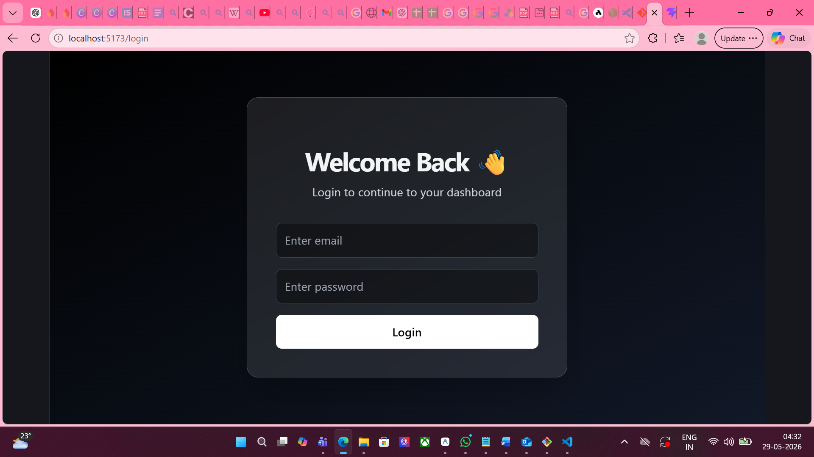
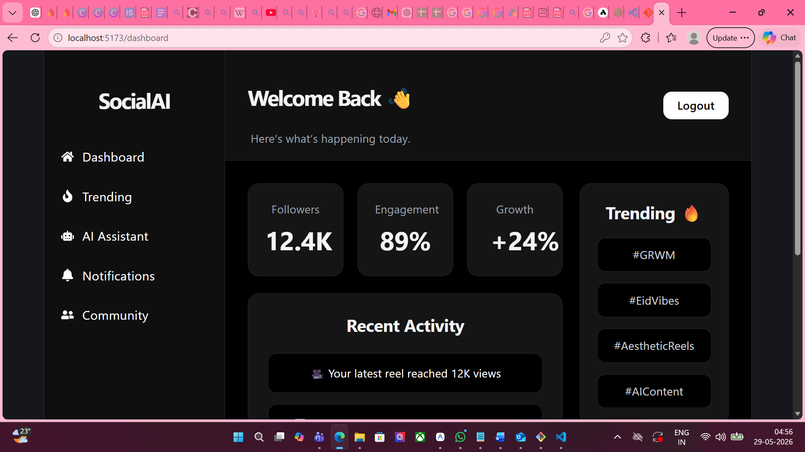
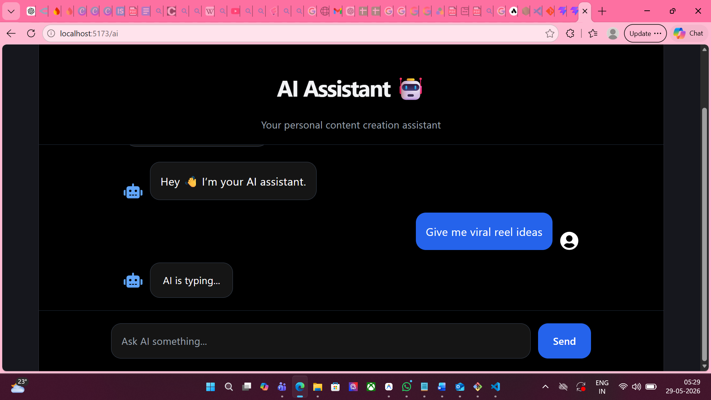
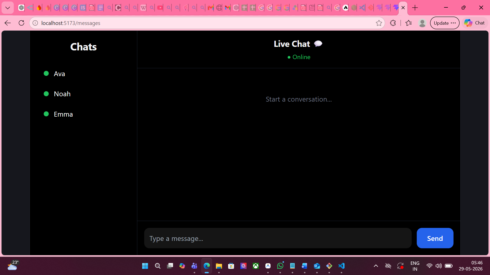
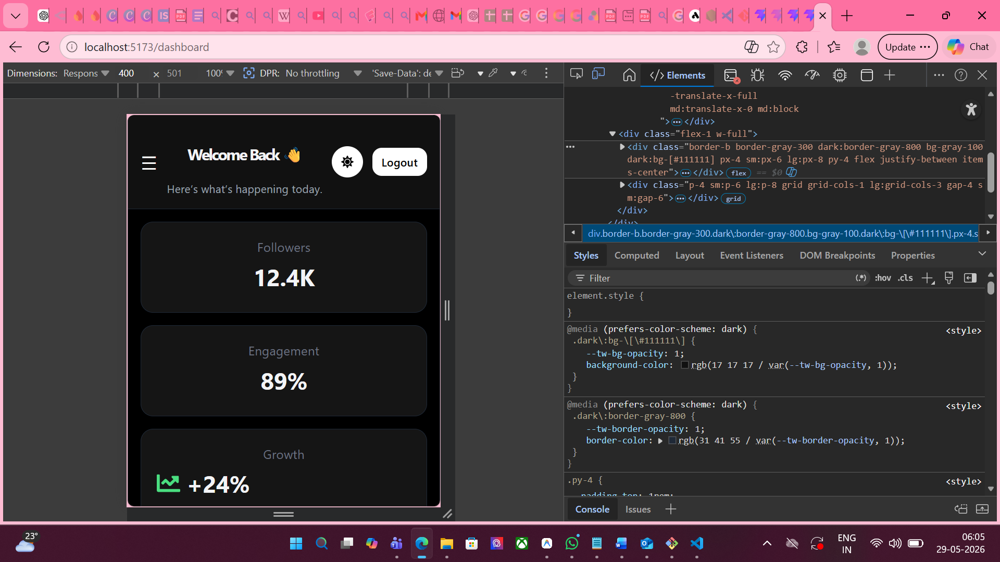

# AI Social Dashboard Frontend

## 📌 Project Overview

AI Social Dashboard is a modern social media dashboard built using React and Vite.
The application includes authentication, AI assistant integration, messaging UI, notifications, responsive design, dark mode, animations, and real-time inspired features.

This project was created as a frontend internship project to demonstrate modern frontend development skills.

---

# ✨ Features

* User Registration & Login
* Protected Routes Authentication
* AI Assistant Chat UI
* OpenRouter AI API Integration
* Social Feed UI
* Real-time Messaging Interface
* Notifications Panel
* Responsive Dashboard
* Dark / Light Mode
* Skeleton Loaders
* Form Validation
* Error Handling System
* Mobile Responsive Design
* Framer Motion Animations
* Modern UI/UX

---

# 🛠 Tech Stack

## Frontend

* React.js
* Vite
* Tailwind CSS
* React Router DOM

## APIs & Libraries

* Axios
* OpenRouter AI API
* Socket.IO Client
* Framer Motion
* React Icons

## Deployment

* GitHub
* Vercel
* Netlify

---

# 📂 Folder Structure

```bash
src/
│
├── components/
├── pages/
├── routes/
├── context/
├── services/
├── assets/
│
├── App.jsx
├── main.jsx
└── index.css
```

---

# ⚙️ Installation Steps

## 1️⃣ Clone Repository

```bash
git clone https://github.com/devanganasudheendran05-lang/ai-social-dashboard-frontend.git
```

---

## 2️⃣ Open Project

```bash
cd ai-social-dashboard-frontend
```

---

## 3️⃣ Install Dependencies

```bash
npm install
```

---

## 4️⃣ Start Development Server

```bash
npm run dev
```

---

# 🔑 API Integration

The project uses OpenRouter AI API for the AI Assistant feature.

## Environment Variable

Create a `.env` file:

```env
VITE_OPENROUTER_API_KEY=your_api_key_here
```

---

# 🌐 Deployment Steps

## Vercel Deployment

1. Push project to GitHub
2. Open Vercel
3. Import GitHub repository
4. Configure build settings
5. Deploy project

---

## Netlify Deployment

1. Connect GitHub repository
2. Import existing project
3. Set build command:

```bash
npm run build
```

4. Set publish directory:

```bash
dist
```

5. Deploy site

---

# 📸 Screenshots

## Landing Page



## Dashboard



## AI Assistant



## Messaging UI



## Mobile Responsive UI



---

# ⚠️ Challenges Faced

* Handling protected routes properly
* Managing API integration securely
* Fixing GitHub push protection errors
* Implementing responsive layouts
* Managing state across multiple pages
* Deploying environment variables correctly

---

# 🚀 Future Improvements

* Real backend integration
* Database support
* Real-time messaging backend
* User profile customization
* AI-generated analytics
* Better notification system
* Advanced authentication system
* Media uploads support

---

# 👩‍💻 Author

Developed by Devangana Sudheendran

---
